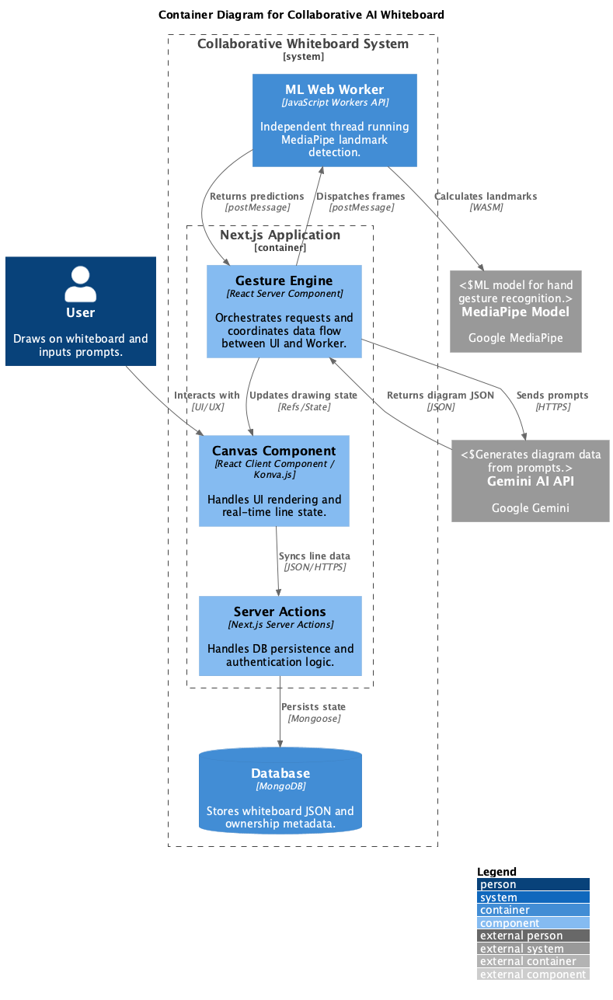

# Slate – Hands Free Gesture Based Whiteboard

https://github.com/frankislamucc/CS3305-Team2

| Name                    | Student Number |
| :---------------------- | :------------- |
| Frank Islam             | 123366953      |
| Oisin O'Mahony          | 123498662      |
| Tom Colbert             | 123353803      |
| Rory O'Brien            | 123467622      |
| Naoise O'Sullivan       | 123400226      |
| Rakib Ishaque Chowdhury | 123383941      |
| Darragh Maher           | 123367013      |

**Academic Integrity Declaration**

We declare that this project is submitted solely for the purpose of the CS3305 module. All work presented is entirely our own and was completed without assistance from any individual outside of our group. The only external aid used was Generative AI, the use of which is permitted and its usage is documented within this report.

## 1. Introduction

### 1.1 Project Overview

Slate is a web-based collaborative whiteboard controlled entirely through hand gestures. Rather than using a mouse or pen, users draw, pan, zoom and select tools by moving their hands in front of a standard webcam. The application tracks hand landmarks using Google's MediaPipe library and translates gestures such as a pinch to draw or an open palm to stop, into canvas actions in real time.

The project is built with Next.js 16 (React 19, TypeScript) on the frontend, using Konva for canvas rendering and a Web Worker to run gesture recognition without blocking the UI. The backend is a custom Node.js server with Socket.IO for real-time collaboration, MongoDB for data storage using JSON and JWT authentication. The whole app is containerised with Docker Compose.

Key features include gesture-driven colour and brush size selection, undo/redo, whiteboard sharing with live notifications and screen recording.

### 1.2 Problem Statement

Existing digital whiteboards all rely on conventional input like mouse, trackpad or stylus. This presents several issues:

- **Accessibility** — users with motor impairments or repetitive strain injuries may struggle with these input methods.
- **Unnatural interaction** — drawing with a mouse feels disconnected from the natural act of sketching on a real whiteboard.
- **Hardware cost** — devices like SMART Boards or drawing tablets address some of these issues but are expensive and impractical for most individuals.

What is missing is a free browser-based whiteboard that works with just a webcam that nearly every laptop already has. Slate was built to fill this gap: a hands-free, gesture-controlled whiteboard that requires no additional equipment.

### 1.3 Objectives & Goals

**Primary Objectives:**

1. **Gesture-controlled drawing** — use webcam-based hand tracking as the sole input for drawing on the canvas.
2. **Real-time collaboration** — allow multiple users to work on the same whiteboard simultaneously via WebSockets.
3. **User authentication** — registration, login and JWT session management so whiteboards are linked to user accounts.
4. **Canvas persistence** — save whiteboard state to MongoDB so users can reload their whiteboards.
5. **Core whiteboard tools** — colour selection, brush sizing, undo/redo, panning and clearing.
6. **Containerised deployment** — package the app with Docker Compose for an easy and lightweight deployment.

**Secondary Objectives:**

7. **Whiteboard sharing** — share boards with other users with real-time Socket.IO notifications.
8. **Session recording** — screen recordings that can be uploaded, replayed and downloaded.
9. **Smooth tracking** — apply a smoothing algortihm to hand landmark data to reduce jitter.
10. **Performant processing** — run MediaPipe in a Web Worker to keep the main thread responsive.

### 1.4 Scope & Limitations

**In scope:** A fully functional, deployable web application covering the complete development lifecycle — requirements, design, implementation, testing, deployment, and this report.

**Limitations:**

- **Mobile** — designed and tested for desktop browsers only.
- **Offline mode** — an internet connection is required for authentication, persistence and collaboration.
- **Security hardening** — JWT auth and httpOnly cookies are implemented but no formal security audit, rate limiting or CSRF protection was carried out. The app is not fully ready yet for large scale production.
- **Browser compatibility** — tested primarily in Chrome and Safari. Other browsers were not formally verified.
- **Scalability** — tested with a small number of concurrent users and no load testing was performed.

---

## 2.Background Research

### 2.1 Existing Collaborative Whiteboard Tools

With the rise of remote and hybrid working structures, along with the ever-increasing public reliance on the Internet, the demand for a collaborative whiteboard tool has never been higher. Essential to beginning this project was understanding the landscape in which we are bringing it to birth, otherwise we risk positioning ourselves as a redundant imitator rather than a distinct tool.

Naturally, with this growing demand, several suppliers have stepped up to try and meet the need. Chief among these tools is Miro, a sort of pseudo-standard canvas tool that incorporates "sticky-note" widgets along with a host of other features to encourage free-form visual collaboration. Miro supports synchronous and asynchronous collaboration, boasts over 100 third-party integrations and offers flexible approaches to sharing and roles, with configurable access to allow for adaptive collaboration.

In contrast, the Microsoft Whiteboard tool benefits from foundational integration with the Microsoft 365 ecosystem, making it a natural choice for organisations committed to tools like Teams and OneDrive. It offers "sticky notes" and real-time co-authoring, similar to Miro, but whiteboards are saved to OneDrive where they can be revisited asynchronously. The platform provides basic functionality rather than advanced facilitation tools, making it more of a convenient built-in option than a specialist tool.

Across these tools, and the many others that become available year-on-year, we see certain patterns emerge. All provide infinite canvases with basic drawing tools. All offer collaboration with others, whether synchronously or asynchronously. Many now offer templates for common workflows and integrations with other prevalent tools.

However, the focus of this project is the gap we see across all of these tools; they all rely exclusively on conventional input methods. For the vast majority of users, this means a mouse or trackpad, which, while ubiquitous tools, provide little utility as implements for drawing. Drawing with a mouse feels disconnected from the natural gesture of drawing with pen or pencil, and similarly drawing with a trackpad feels unintuitive and awkward. While users could utilise a stylus with a tablet-like touchscreen, the requirement for external hardware is a significant barrier to entry for the basic function of these tools.

Therefore, what is missing is a whiteboard tool which, without need for external hardware, allows for natural and intuitive interaction. It is from this standpoint that we approach the concept of gesture recognition. Though deep learning models for gesture recognition improve year-on-year, there are no mainstream collaborative whiteboard tools utilising this new technology, despite the ubiquity of laptop webcams. Using only that basic webcam of a laptop, we can use the deep learning MediaPipe framework provided by Google to track on-screen hands and recognise the motions made, which are then mapped to basic drawing functions. This is the niche that Slate aims to fill. A collaborative whiteboard where users draw, pan, and zoom through natural hand movements, requiring no costly additional hardware. By combining this nascent technology with capabilities akin to existing products, we open whiteboarding to new use cases.

### 2.2 Real-Time Communication Technologies (WebSockets, Socket.IO)

The idea of collaborative whiteboarding creates requirements for real-time communication. When one user draws a line, the other must see that line with minimal latency. Achieving this requires moving beyond the traditional request-response model of HTTP.

HTTP follows a synchronous pattern: the client initiates a request, the server processes it, and the server returns a response. For real-time collaboration, this creates several problems. First, the server cannot initiate communication, it cannot notify clients of changes unless those clients poll for updates. Polling introduces either high latency or excessive overhead, depending on frequency. Second, each request establishes a new connection, adding TCP handshake overhead. Third, maintaining state across multiple requests requires additional mechanisms like sessions or tokens.

WebSockets address these limitations by providing a full-duplex communication channel over a single TCP connection. After an initial HTTP upgrade handshake, the connection persists, allowing either party to send messages at any time. This allows for low latency, bidirectional communication and high efficiency in typical use.

For a whiteboarding application, this provides critical functionality: when User A draws a stroke, the client sends a message describing said stroke, and the server then broadcasts it to User B, whose client renders it immediately.

Socket.IO provides a necessary abstraction layer over raw WebSockets, as support for WebSockets differs across browsers and configurations, and connections can be blocked by firewalls. Socket.IO addresses such challenges by offering automatic connection management to handle reconnection, using exponential backoff to avoid overwhelming servers. Socket.IO can also fall back to HTTP long polling if WebSockets are, for some reason, unavailable. Socket.IO also groups connections into "rooms", ensuring messages are broadcast only to viewers with access to a specific board, not all connected users. Socket.IO also provides support for passing JWT tokens during the connection handshake, further ensuring authorisation of users.

For Slate, Socket.IO provides an ideal tool for collaboration. The gesture-based drawing system generates a stream of actions that map to Socket.IO events. Automatic reconnection handles temporary network interruptions gracefully, which is critical for users who may move between network environments.

### 2.3 Gesture Recognition in Web Applications

Enabling gesture-based whiteboard control requires solving a complex computer vision problem in real time within the browser environment. The system must detect hands, track their movement across frames, interpret gestures and map those gestures to drawing actions while maintaining responsive UI performance. This section will examine the technology that makes this possible.

Firstly, and perhaps most fundamentally, Google's MediaPipe framework, specifically its Hand Tracking solution, has emerged as the leading technology for in-browser hand perception. MediaPipe Hands is made up of two models working in sequence, a palm detection model that identifies hand bounding boxes, followed by a hand landmark model that localises 21 key points across each hand, including fingertips, knuckles and the palm base. These landmarks are returned as coordinates, along with a depth value relative to the wrist.

With landmarks identified, MediaPipe can classify predefined gestures including Closed Fist, Open Palm, Pointing Up, &c. Each of these is accompanied by a confidence score that allows applications to threshold recognition reliability. However, for a drawing application, recognition must occur continuously as the user moves their hand. MediaPipe's Video mode processes each webcam frame with timestamps to maintain coherence. However, even Google's documentation notes that calls to MediaPipe's recognition methods run synchronously and block the user interface thread.

The recommended solution, and the one employed in Slate, is running MediaPipe in a Web Worker on a separate thread. The worker receives video frames from the main thread, processes them through MediaPipe, and posts results back. This architecture ensures the UI thread remains responsive to user input and canvas rendering continues smoothly while recognition runs at full speed without contention.

For Slate's whiteboard control, we take MediaPipe's landmarks and perform our own distance calculations to map functions such as drawing, panning and zooming to custom-defined gestures, allowing for full usage of the hand's range of mobility. The system requires only a standard webcam with no specialised equipment, making our gesture-based whiteboarding accessible to anyone with a laptop.

---

## 3. Requirements Analysis

This section outlines the requirements that define the behaviors and capabilities of Slate as an application. Requirements analysis was conducted through group discussions, evaluating competitors in the market and considering how gesture-based interaction could be incorporated into a collaborative workspace.

The goal of the system is to provide a fully functional whiteboard application that can be controlled using hand gestures captured through a webcam. The system should support real time gesture recognition, collaborative drawing, user authentication, persistent data storage and recording functionality while maintaining a responsive and low latency performance in a web browser.

The requirements are divided into functional and non-functional categories. Functional requirements describe the specific features the system must provided, while non-functional requirements describe the quality attributes and constraints which the system must operate.

### 3.1 Functional Requirements

Functional requirements define the core behaviour of the system and the features that the end user interacts with. The requiremtns are gotten from the primary objectives of the project and the uses we intend the application to have for the end user wether it be assistance with teaching or a collaborative tool.

#### User Account Management

- **User Registration**
  The system will allow new users to create an account using a unique username and password.

- **User Authentication**  
  The system will allow existing users to log in securely using their credentials.

- **Session Management**  
  The system will maintain authenticated user sessions using JSON Web Tokens (JWT) stored in httpOnly cookies.

- **Access Control**  
  The system will restrict access to certain pages and functionality to authenticated users only.

#### Gesture Recognition and Interaction

- **Hand Tracking via Webcam**  
  The system will capture video input from the user’s webcam and detect hand landmarks using the MediaPipe framework.

- **Gesture Interpretation**  
  The system will interpret specific hand gestures and map them to whiteboard actions such as drawing, stopping, panning or zooming.

- **Gesture-Based Drawing**  
  The system will allow users to draw on the whiteboard canvas using recognised gestures.

- **Gesture-Based Tool Control**  
  The system will allow gestures to be used to control drawing tools such as colour selection, brush size adjustment and undo/redo.

#### Whiteboard Functionality

- **Real-Time Whiteboard Rendering**  
  The system will display user drawing actions on a digital whiteboard in real time.

- **Canvas Interaction Tools**  
  The system will provide tools such as colour selection, brush size selection, undo/redo functionality and canvas clearing.

- **View Transformation**  
  The system will allow users to pan and zoom the whiteboard canvas.

#### Recording and Playback

- **Screen Recording**  
  The system will allow users to record their whiteboard session directly from within the application.

- **Recording Storage**  
  The system will allow recordings to be saved and associated with user accounts.

- **Recording Playback**  
  The system will allow recorded sessions to be previewed within the application.

- **Recording Download**  
  The system will allow users to download recorded sessions locally.

### 3.2 Non-Functional Requirements

Non-functional requirements define the quality, attributes and constraints under which the system must operate. These were derived from the project's technical goals and the practical constraints of running a machine learning model inside a web browser.

#### Performance

- **Responsive Gesture Tracking**  
  The gesture recognition pipeline must process webcam frames and return landmark data with low enough latency that drawing feels real-time to the user. Running MediaPipe in a Web Worker ensures the main UI thread is never blocked.

- **Smooth Drawing Experience**  
  Hand landmark jitter must be mitigated by the 1€ smoothing filter and interpolation so that drawn lines appear clean and intentional rather than erratic.

- **Efficient Canvas Rendering**  
  The canvas must use a separate active-line layer so that adding points to the current stroke does not trigger a full rerender of all existing strokes.

#### Usability

- **No Additional Hardware**  
  The system must function using only a standard laptop webcam. No external device needed.

- **Intuitive Gesture Mapping**  
  Gestures should feel natural and be physically distinct from one another to minimise accidental activation. Drawing uses a index pinch, panning uses a middle-finger pinch and zooming uses a gun shape to keep each action clearly separated.

- **Consistent UI**  
  The application must present a coherant, high quality visual design across the landing page, authentication pages, whiteboard and settings using Tailwind CSS.

#### Reliability

- **Automatic Saving**  
  Canvas state must be persisted to MongoDB after every meaningful action so that a browser crash or accidental navigation does not result in data loss.

- **Automatic Reconnection**  
  Socket.IO must handle temporary network interruptions transparently using its built-in reconnection with exponential backoff.

- **Error Handling**  
  If the webcam is unavailable or permission is denied, the application should inform the user clearly rather than crash silently.

#### Security

- **Secure Authentication**  
  Passwords must be hashed with bcrypt before storage. JWT tokens must be stored in httpOnly cookies to prevent client-side script access.

- **Route Protection**  
  Next.js middleware must enforce authentication on all protected routes before any page rendering occurs so unregistered users cant access the whiteboard.

- **Input Validation**  
  All user data must be validated server-side with Zod schemas to prevent malicious input from reaching the database like injection attacks.

#### Portability & Deployment

- **Containerised Deployment**  
  The application must be packaged as a Docker image and orchestrated with Docker Compose so that it can be deployed on any machine with Docker installed using a single command.

- **Environment Configuration**  
  All secrets (MongoDB URI, JWT secret) must be supplied via environment variables so that the same image works across development and production.

#### Scalability

- **Stateless Architecture**  
  The server must not maintain session state between requests. JWT verification and MongoDB queries are performed per-request, allowing horizontal scaling behind a load balancer in the future.

- **External Database**  
  MongoDB Atlas is used as an external service so that the application container itself holds no persistent data and can be replaced or replicated without migration.

### 3.3 User Stories / Use Cases

User stories focus on the perspective of the end user by describing how different users may interact with the application.

- **User Story 1 - Drawing with Gestures**
  As a user, I want to draw on the whiteboard using hand gestures so that I can interact with a canvas without needing a mouse or stylus.

- **User Story 2 - Controlling Drawing Tools**
  As a user, I want to change drawing colour and brush size so that I can customise how I use the drawing function

- **User Story 3 - Saving Whiteboards**
  As a user, I want my whiteboard sessions to be saved so that I can see and share them later

- **User Story 4 - Recording a Session**
  As a user, I want to record my whiteboard session so that I can review or present my recordings.

- **User Story 5 – Viewing Recordings**  
  As a user, I want to access my saved recordings so that I can replay previous recordings.

- **User Story 6 – Secure Login**  
  As a user, I want to log into my account so that my work and recordings are associated with me.

- **User Story 7 – Easy Access to the Application**  
  As a user, I want to open the application in a web browser without installing additional software.

These user stories guided the design and implementation of the application, ensuring that the system remained focuses on providing a natural and accessible gesture based whiteboard application.

---

## 4. System Architecture & Design

### 4.1 High-Level C4 Architecture Diagram



### 4.2 Tech Stack

#### 4.2.1 Frontend

The frontend of this application is rendered using [Next.js](https://nextjs.org/) version 16. This is a [React](https://react.dev/learn) based full-stack framework that allows both server and client rendering.

- **Component Architecture:** UI layout is wrapped in a main page and modular sub-components in separate files are imported. This makes complex animations and blocks of JS and HTML logic to be grouped into individual components/functions, resulting in easier readability and maintenance.
- **Canvas Rendering:** The whiteboard canvas is built using the **Konva.js** library. [Konva.js](https://konvajs.org/) is a 2D graphics library that has optimized browser integration and React support. React `refs` can be passed to gesture prediction components to control the state of the Konva.js shapes.
- **Styling & UI:** \* **Tailwindcss** is used for inline styling of components; [Tailwindcss](https://tailwindcss.com/) had a small learning curve but removed the overhead of switching between style files and JSX/component logic.
  - For complex animations such as the landing page's bento box and the dynamic background effect, **Shadcn** was used. [Shadcn](https://ui.shadcn.com/) is a React component library that has pre-built components—such as buttons, responsive navbars, and footers—that enabled a smooth transition from a Figma design to a React implementation.

#### 4.2.2 Backend

Users authenticate with the application using **JWT tokens**. The **[Jose json-encryption](https://jose.readthedocs.io/en/latest/)** library is used to sign theese tokens with a secret-key and randomised salt.

- **Validation:** For server side form validation, the **[Zod](https://zod.dev/)** TypeScript-first validation library is used. This allows us to create a schema/type for form inputs using Zod's typescript types.
- **AI Orchestration:** There is a single authentication source for the server to make LLM requests, via a client secret. The **[google/genai](https://www.npmjs.com/package/@google/genai)** library retrieves this secret from a local env var, enabling stateless server actions to make new clients across requests. The **gemini-3.1-flash-lite** model is used to process requests as it has a high free rate-limit and is one of the latest stable releases.
- **Gesture Recognition:** Google's MediaPipe **[GestureRecognizer](https://ai.google.dev/edge/mediapipe/solutions/vision/gesture_recognizer)** is a synchronous model used toanalyse hand movement and provide predictions. It uses **[wasm](https://webassembly.org/)** to run natively in the browser using availbale CPU's or GPU's.
- **Data Persistence:** A **[MongoDB](https://www.mongodb.com/)** database is used to persist canvases and user credentials. The **[MongoDB Atlas](https://www.mongodb.com/products/platform/atlas-database)** service, offers 512MB of storage for free and provided easy integration because of it's clear and concise documentation.

#### 4.2.3 Deployment

For the app deployment we chose a **[containerized](https://www.docker.com/resources/what-container/)** approach. Next.js statelessness nature supports emphemeral containers out of the box.

- **State Management:** No state is maintained accross requests as **[JWT](https://www.jwt.io/)** tokens can be verified on a per request basis. Persistence is also avoided in a container approach by using MongoDB atlas to host the database.
- **Orchestration:** **[Docker compose](https://docs.docker.com/compose/)** is used to run our optimized image in a single container but allows for easy future replication.
- **Architectural Decisions:** A **[kubernetes](https://kubernetes.io/docs/home/)** deployment was discussed but deemed unnecessary for our use case.
  - The application does not maintain session data and has most computation performed client side.
  - Both the model and canvas rendering use client components with only LLM requests and responses being handled on the server.
- **Risk Mitigation:** Using load balancing, microservice architecture does not match this monolith application design. Kubernetes present risks such as resource costs from management nodes and overhead of using external tools like **[KIND](https://kind.sigs.k8s.io/)** to create clusters. Our single image and Docker compose file is the most scalable and maintainable approach for our API design.

### 4.3 API Design

Both [server and client components](https://nextjs.org/docs/app/getting-started/server-and-client-components) are utilized to choose when logic should and should not be rendered Client side.

### Client Components

Next.js client components allow us to access **state/memory** in the browser. This, in turn, is used by routes such as the landing page for dynamic interactivity, including:

- **Toggling button behavior**
- **Animation effects**

### Server Components & Security

Server components are used to stream React-generated HTML to the client, which is used to pre-render pages server side and stream the response.

> **Example:** The `ChatEngine` component uses a protected API key to safely authenticate with the [Gemini API](https://ai.google.dev/gemini-api/docs). A server component allows the API key to **only exist on the server** whilst still being able to stream the LLM response.

### Server Actions

[Server actions](https://nextjs.org/docs/app/guides/forms) are serverless (stateless) functions that use their function names as a URL. They are utilized for:

1.  **Data Validation:** Extensively validating form data beyond basic input requirements (e.g., password length).
2.  **Authentication:** Sending an **HTTP-only cookie** in responses for the browser to securely store the JWT access token for subsequent requests.

---

## Component Design: Decoupling Logic

A clear design decision was made to separate the **gesture prediction logic** from the **canvas rendering**. To do this, we used a Gesture engine and a Canvas component.

| Entity               | Responsibility                                                                |
| :------------------- | :---------------------------------------------------------------------------- |
| **Gesture Engine**   | Handles prediction logic; decoupled from implementation via an API.           |
| **Canvas Component** | Provides a "black box" handler; manages real-time rendering and state export. |

**The Integration Strategy:**

- The canvas provides a **handler object** to the Gesture engine, offering an API to perform CRUD operations on the Canvas.
- Developers of the gesture recognition were able to completely decouple themselves from the canvas implementation by using this API.
- Canvas developers, in turn, had to provide a black box handler that covered all requirements of the gesture engine (e.g., rendering a real-time line and exporting the current canvas state).

## 5. Implementation

### 5.1 Authentication System

The authentication system handles registration, login and session management. It was one of the first features built because almost everything else in the app depends on knowing who the current user is. The system is built with Next.js Server Actions, JWT tokens and httpOnly cookies.

#### 5.1.1 Registration & Login Flow

Both the login and register pages share a reusable `AuthForm` component that renders a username/password form. The pages are thin client components that wire the form up to a Server Action using React 19's `useActionState` hook. This gives us a clean way to call a server-side function from a form submission and get back validation errors without writing manual fetch calls or API routes.

When a user submits the register form the `registerAction` in `src/app/(auth)/actions/register.ts` runs on the server. It first validates the input with a Zod schema defined in `src/lib/validation/auth.ts` which enforces that usernames are 3 to 20 characters containing only letters, numbers and underscores and that passwords are at least 8 characters. If validation fails the action returns human readable error messages in a red banner.

If validation passes the action connects to MongoDB, checks whether the username is taken and if not hashes the password with `bcryptjs` using a salt of 10 rounds before creating the user document. The User model in `src/app/models/User.ts` is a straightforward Mongoose schema with `username`, `password` and `createdAt` fields. After creating the user it generates a JWT containing the `userId` and `username` and sets it as an httpOnly cookie named `session` with a 7 day expiry. Once set the action calls `redirect("/")` to send the user to the home page.

The login flow in `loginAction` follows the same structure. It validates with the same Zod schema, looks up the user by username and uses `bcrypt.compare` to check the password against the stored hash. It deliberately returns the same generic "Invalid username or password" message whether the username does not exist or the password is wrong to avoid leaking which usernames are registered. On success it creates a JWT and sets the cookie just like registration does. Logout simply deletes the session cookie since JWTs are stateless and no server-side invalidation is needed.

One thing worth noting: the `redirect()` call in both actions is placed **outside** the try/catch block. Next.js internally throws an error to perform a redirect so if that throw gets caught the redirect silently fails. This tripped us up during development until we figured out what was happening.

#### 5.1.2 Session Management & Middleware

Session management revolves around the JWT stored in the `session` cookie. The `src/lib/auth.ts` file contains all the token utilities. `createToken` builds a JWT signed with HS256 using `jose` with a 7 day expiration. `verifyToken` decodes a token and returns null if it is expired or tampered with. `getSession` reads the cookie and calls `verifyToken`. `getAuthenticatedUser` goes further by looking up the full user document from MongoDB using the `userId` in the payload which is needed in places like the whiteboard page.

Route protection is handled by Next.js middleware in `src/middleware.ts`. It runs on every request matching the `matcher` pattern covering `/login`, `/whiteboard`, `/home`, `/settings` and `/recordings`. The middleware reads the `session` cookie and verifies it with `jwtVerify`. If someone tries to access a protected route without a valid session they get redirected to `/login`. If a logged in user visits `/login` they get sent to `/whiteboard` since there is no reason for them to see the login page again.

Using middleware rather than checking the session inside each page gives us a single source of truth for access control that runs before any page rendering. It also keeps the page components clean since they do not need to handle auth checks themselves.

### 5.2 Whiteboard Canvas

#### 5.2.1 Drawing Engine & Canvas API

### Drawing Engine & State Management

The drawing engine is an **isolated API** provided by the Canvas component, located in the `Canvas.tsx` file. The parent whiteboard `page.tsx` passes a ref to the Canvas engine to set the ref object to a handler object.

#### Abstraction via Refs

A ref is used here as it allows the child component Canvas to set the object without re-rendering the component tree. The React hook [useImperativeHandle](https://react.dev/reference/react/useImperativeHandle) sets the `ref.current` to a handler object with functions such as:

- `exportLine`
- `drawLine`

This approach provides functionality without giving direct access to the canvas components, creating a **clear layer of abstraction** between the Canvas rendering and the gesture predictions. The page component can then share this ref handler with the gesture engine to call when predictions are updated.

---

### Optimized Rendering with Konva.js

Inside the Canvas component, the **Konva.js** React library is harnessed for optimized 2D rendering. The `Stage` component wraps layers of grouped shapes:

1.  **Persistent Layer:** Consists of line data passed as a prop from the parent component. This state is persisted in the **MongoDB store**.
2.  **Active Line Layer:** To avoid re-rendering the entire state for every point update, we employed a separate **Line object**. This single Line is updated for every point added via the handler, but crucially only re-renders all the line data when a user has stopped drawing and the current line is added to the MongoDB store.
3.  **UI/Utility Layers:** Added to visualize highlighted lines for copying and to integrate size selection and a color wheel.

#### Shape Visualization

All 2D visualization is drawn using a **Line shape**, with one primary exception:

- **LLM Generated Data Structures:** Uses arrows and circles to more accurately represent nodes and pointers for linked structures.

#### 5.2.2 Colour Selection & Size Selector

It was an important consideration that the internal canvas UI and the external React based UI had a clear separation of responsibilities. The external UI is used for lower priority features, features that link with other, non-canvas related parts of the system, and fallback options for features that are already encapsulated by gestures.

Choosing the size of your pen and the colour you write with were identified as the most core options for users and are therefore were assigned to central gestures. Both the `ColourWheelSpinner` and `SizeSelector` are implemented as React components which sit in a separate Konva layer above the drawing canvas. This ensures data integrity for user creations.

The spinner is implemented using Konva. The rotation of the wheel is controlled by a `rotationAngle` property, and the component calculates the selected segment based on this angle which is approximated from a normalized horizontal motion. The active segment is visually highlighted by increasing its size and opacity. Similarly for sizing, a normalized vertical motion is used to navigate a sequence of Konva `rects` mapping to different fill widths.

#### 5.2.3 Undo/Redo System

The undo/redo system is functionally a command pattern centred on discrete actions. Rather than storing entire canvas snapshots, which would end up being very memory intensive, the system records each user line stroke and maintains an undo stack and a redo stack.

The system is implemented as a dedicated class that manages the two independent stacks. The class provides methods for recording four types of actions: adding a single line stroke, adding multiple line strokes (for pasting operations), clearing the entire canvas, and replacing a set of strokes (for cutting operations). Each action type encapsulates data to reverse the operation completely.

The undo operation pops the most recent action from the undo stack and pushes it onto the redo stack. The action is then reversed. So if a line was added, it is removed from the canvas or if the canvas was cleared, all cleared content is restored.

The redo operation reverses this by moving the action back to the undo stack. The key feature here is that the `React` component state always remains the primary source for rendering. The undo/redo stacks never directly manipulate component state. Instead, the stacks store action data, and the parent component uses this data to update state, which then triggers the system to render again.

#### Off Hand Gesture Activation

The undo and redo features are mapped to left/off hand gestures. The left/off hand is recognised by the system, simply tracking the second hand that appears on camera and treating it as the left/off hand. The first hand that appears on the camera is allocated as the right/main hand, responsible for all controls apart from undo/redo. We made this separation to keep the undo/redo features easily accessible while also preventing any accidental triggers while drawing.

`Undo gesture:` With the left/off hand, do an index finger pinch. The gesture fires once, then enters a 500ms cooldown to prevent accidental repeated undos if the user holds the gesture.
`Redo gesture:` With the left/off hand, do a ring finger pinch. The same cooldown applies.

The gestures were kept a finger apart due to the fact that the off/left hand was allocated for specifically undo/redo, meaning we were not compromising on gestures by having that space between them. The space simply provides another means of mitigation against gesture misidentification.

#### 5.2.4 View Transform (Pan/Zoom)

The whiteboard operates in two coordinate spaces. `Screen space` refers to pixels relative to the browser window, with the origin at the top-left. `Canvas space` refers to the logical coordinates of the whiteboard, where users can zoom and pan freely. All drawn strokes are stored in canvas space; rendering requires conversion to screen space.

The `ViewTransform` class manages the transformation between these spaces, encapsulating all the operations required for correct rendering under arbitrary zoom and pan. This class maintains three key parameters that fully define the view state. A scale factor, an X offset representing horizontal pan in screen pixels, and a Y offset representing vertical pan. The class also defines constraints such as a minimum scale of 0.5x, a maximum scale of 3.0x, and a pan damping factor that moderates the speed of pan operations to filter hand jitter.

Using these maintained values the screen can redraw what is on the canvas as well as apply the canvas transforms without making any visible difference to the user. The line strokes already on the canvas are redrawn accounting for scale and offset every time either scale or offset change, allowing for seamless and efficient zooming and panning. The visual cursor also accounts for the scale and offset so that it always accurately shows where the user is about to draw.

Zooming is implemented with point centered scaling, which ensures a specific reference point on the canvas remains fixed at the same screen position before and after the zoom operation, even as the scale changes. This is crucial for usability because if a user zooms at their cursor position, they expect that position to stay under the cursor.

#### Zooming

The algorithm begins by storing the old scale factor, computing the new scale factor with clamping, and then recalculating the pan offsets dynamically. If a point in canvas space maps to a particular screen position, and we want that screen position to remain fixed after zooming. A change notification callback is invoked whenever zoom occurs, triggering a `React` state update that causes Konva to re-composite the scene with the new transforms applied.

#### Panning

Panning is simply a direct translation of the view. When the user pans, the system adds the pan delta to both the X and Y offsets. The `panSpeed` factor serves as a damping multiplier that amplifies the hand movement slightly to make panning feel responsive. We kept this low as a factor of exactly 1.0 would provide a direct movement correlation. The damping prevents the canvas from jittering with every small hand tremor. A callback notifies the parent component that the view has changed, triggering a re-render.

#### Gesture for Pan & Zoom Control

`Panning Gesture:` Panning is done by simply doing a middle finger pinch and moving the hand around as if you are dragging the canvas. The panning accounts for the fact that for this to work the canvas is actually moving inversely to the hand, but this was done as it would feel the most natural to the user.

`Zooming Gesture:` Zooming is done by making a gun with the main hand that is pointing towards the user's left. While this may sound like a far leap from all of our pinching gestures so far, due to the thumb being distinctly away from the rest of the fingers during this gesture, gesture misidentification is heavily mitigated. The gun would then be moved up and down to allow the user to zoom in or zoom out. Since the zooming is based on a hand landmark node on the palm, smoothing filters were also applied to this gesture in particular to prevent aggressive zooming.

#### Re-rendering

Konva's `Stage` component provides built-in properties for applying 2D transformations to all child elements. When the Canvas component renders, it configures the Stage with the current scale and offset values from `ViewTransform`. Konva internally manages all transformation matrix mathematics. The application simply provides the scale and offset parameters, and Konva applies them uniformly to every shape in the rendered scene. This abstraction eliminates the need for manual matrix composition.

### 5.3 Real-Time Collaboration

#### 5.3.1 Socket.IO Integration

The custom server in `server.mjs` runs both Next.js and Socket.IO on a single port by attaching a Socket.IO server at the `/api/socketio` path with CORS enabled. There is no separate WebSocket service to deploy.

To track who is online the server keeps a `userSockets` Map that links each userId to a Set of socket IDs. On connection the server reads the userId from the handshake auth payload and registers the socket. When disconnecting it removes the ID and cleans up the entry if the user has no remaining connections. This handles multiple tabs since each tab gets its own socket but they are all grouped under the same user.

The `io` instance and `userSockets` map are exposed on `globalThis` so Next.js server actions can emit events without importing the server module directly. On the client side a `useSocket` hook connects on mount and listens for a `whiteboard-shared` event. When it fires the hook shows a toast notification and refreshes the sidebar so the new shared canvas appears immediately.

#### 5.3.2 Canvas State Synchronization

Canvas persistence is handled through Next.js server actions in `actions/canvas.ts`. The main actions are `saveCanvas`, `loadCanvas`, `loadCanvasById`, `getUserCanvases`, `deleteCanvas` and `renameCanvas`. Every action verifies the JWT session first so unauthenticated requests are rejected.

`saveCanvas` handles both creation and updates. If it receives a `canvasId` it updates the existing document, otherwise it creates a new one. It serializes all shape data to strip anything that is not JSON safe before writing to MongoDB. `loadCanvas` fetches the most recently updated canvas for the current user which is what loads on first visit. `getUserCanvases` returns a summary list excluding shared copies so the sidebar only shows original work.

The whiteboard auto-saves on every meaningful action. Drawing a line, cut/paste, etc. all trigger a save. Users never have to manually save. The Canvas model stores lines as point arrays with stroke colour and width and also supports circles, text and arrows for AI generated shapes.

#### 5.3.3 Shared Canvas & Permissions

Sharing is handled by server actions in `actions/share.ts` and a `SharedCanvas` Mongoose model that links a sender to a recipient. The `shareCanvas` action validates ownership, looks up the recipient by username, prevents self-sharing and checks for duplicates. If the canvas was already shared with that person it resets the `seen` flag instead of creating a new record. It then calls `notifyUser` which iterates the recipient's active socket IDs and emits `whiteboard-shared` to each one.

When a recipient opens a shared canvas the `loadSharedCanvas` action checks for an existing personal copy. If there is none it loads the original in read-only mode. The moment the recipient saves changes, a copy-on-write mechanism creates a new Canvas document with `isSharedCopy` set to true and atomically sets `recipientCanvasId` on the share record. Subsequent saves update that copy so the original is never modified by anyone other than the owner.

The `SharedCanvas` model stores references to the original canvas and the optional recipient copy along with both usernames and a `seen` boolean for the notification badge. A compound unique index on `originalCanvasId` plus `recipientId` prevents duplicates at the database level. Recipients can remove a shared canvas from their account which deletes the share record.

### 5.4 Gesture Recognition

#### 5.4.1 GestureEngine & Custom Gestures

We had to extract verifiable gesture data from a set of 21 landmarks from the MediaPipe worker. Mediapipe offers a very limited set of in-built gestures. We supplemented these by creating the `CustomGestures.ts` module which takes the 2D landmarks as an input and runs them through a sequence of gesture recognition algorithms and produces the most likely gesture. These algorithms mostly isolate a specific motion that is both easy for the user to perform and distinct from other gestures.

#### 5.4.2 Web Worker for Performance

The MediaPipe machine learning model is by far the most expensive element of the system and for this reason it needed to be optimised as much as possible. We chose to spin the model onto it's own thread using a worker which runs the model separately from the main React UI thread. This approach significantly counteracted the performance issues which can occur when attempting such intensive computation in a web browser.

#### 5.4.3 Smoothing with the 1€ Filter and Interpolation

Maximising the user experience for the core functionalities like drawing a line was essential. For this reason we made use of a smoothing algorithm to remove the jitter and unpredictability caused by latency. we researched extensively and found that the academic consensus preferred the 1€ Filter for this type of task. The filter was implemented in javascript and a 3 point system was applied when drawing. The filter is applied to the thumb, index and pinch landmarks individually, and subsequently and exponential moving average is taken of all three, finally the output point is interpolated by a 50ms time window. We found that this approach allows for users to better understand how to interact with the application intuitively.

### 5.5 Recording Feature

The recording feature allows users to capture their whiteboard sessions directly from the browser. This functionality was implemented using the browser `getDisplayMedia` API to request screen capture permissions and the `MediaRecorder` API to encode the captured stream into a video file. The recording system runs entirely on the client side and is integrated with the whiteboard page through a dedicated React component so that it does not interfere with gesture recognition or canvas rendering.

When recording begins, the selected screen or tab is captured as a media stream and passed to a `MediaRecorder` instance. Media data is collected in small chunks and stored temporarily until recording stops. Once the session ends the chunks are combined into a `Blob`, which can then be downloaded as a WebM video file.

#### 5.5.1 Recording Controls

Recording controls are implemented through the `ScreenRecorderControls` React component which overlays the whiteboard interface. The component manages the recording lifecycle including starting capture, stopping capture and handling the generated media data. A recording state indicator and timer were added using React state updates to give users clear feedback when recording is active. To improve usability, the system also generates an object URL for the recorded blob which allows the video to be previewed directly in the browser using a standard HTML `<video>` element.

#### 5.5.2 Upload & Storage

The recording system was designed to support integration with backend storage so recordings can be associated with user accounts. Metadata such as filename, duration and file size can be generated from the recorded media and stored alongside user information in MongoDB. This allows recordings to be organised per user and later accessed through a dedicated recordings page within the application. The separation of recording capture and persistence ensures that recordings can still be downloaded locally even if backend storage is unavailable.

---

## 6. Deployment

### 6.1 Docker Containerization

We used Docker to containerise Slate so the application builds and runs the same way regardless of the host machine. This avoided issues like having to manually install all dependencies and packages.

The Dockerfile uses a multi-stage build with three stages:

1. **deps** - Installs npm dependencies on a `node:20-alpine` base image using `npm ci --legacy-peer-deps`. The flag was needed because some dependencies (React 19 and framer-motion) had conflicting peer requirements.

2. **builder** - Copies `node_modules` from the first stage along with the source code and runs `npm run build` to produce the Next.js production build.

3. **runner** - The final image. Only copies what is needed to run: `node_modules`, `.next`, `public`, `server.mjs`, `package.json` and `next.config.ts`. It exposes port 3000 and starts the app with `node server.mjs`.

This multi-stage approach keeps the final image small by discarding source code and build tooling.

### 6.2 Docker Compose Configuration

Docker Compose wraps this into a single command. The `docker-compose.yml` defines one service:

```yaml
services:
  slate:
    build:
      context: ./slate
      dockerfile: Dockerfile
    ports:
      - "3000:3000"
    env_file:
      - ./slate/.env.local
    restart: unless-stopped
```

- **ports** maps container port 3000 to the host so the app is available at `http://localhost:3000`.
- **env_file** loads secrets from `.env.local` which is not committed to the repo.
- **restart: unless-stopped** automatically restarts the container only if it crashes.

To deploy the application:

```bash
docker compose up --build
```

### 6.3 Environment Configuration

Slate uses a `.env.local` file in the `slate/` directory for environment specific config. The required variables are:

`MONGODB_URI`:Connection string for the MongoDB Atlas cluster.

`JWT_SECRET`:Secret key used to sign and verify JWT session tokens

MongoDB Atlas handles database hosting externally so the Docker setup only needs to run the Next.js app itself. If either variable is missing the app falls back to hardcoded defaults which is fine for local development but would need to be changed for a real deployment.

---

## 7. Project Management

### 7.1 Team Roles & Responsibilities

Given the collaborative nature of the group members did more than prescribed below, therefore below is an over arching summary of each members undertakings in the nine weeks.

- Frank - Project Lead and Database
- Rory - Screen Recording and Saving
- Naoise - React, UI and LLM
- Rakib - Gesture Functionality
- Tom - Gestures as Whiteboard features
- Darragh - Smoothing and React conversion
- Oisín - Smoothing and UI

### 7.2 Methodology (Agile/Scrum)

The team chose to use the Agile development methodology with elements of the Scrum framework blended into it. The Agile methodology is just that, a methodology whereas Scrum is a framework for Agile project management that can be followed. It is best to use the methods that allow the project to succeed rather then be held back in trying to follow a framework to the letter.

Agile methodology suited the collaborative nature of the environment in which the project was developed. The size of the group and the list objectives to be achieved would have been significantly hampered by Waterfall with team members waiting for other pieces of the process to be completed before they could even begin working. The Waterfall methodology would have removed the collaborative environment in meetings which allowed new ideas to be pitched at all times to solve individual parts of the design. This open and discussion heavy space needed the Agile methodology to ensure the group was adaptable in a fast moving development environment.

Parts of Scrum that were utilised were the Sprints, Sprint planning, Sprint demo and Project Lead. The Sprints gave structure to an open project development environment by providing immediate deadlines week on week to ensure that new integrations, bug fixes and changes were continuously made. This was in an attempt to have continuous improvement to the deployable product so as to meet the aforementioned short deadline.
Sprint Planning took place each Wednesday before or after the meeting with Klaas as did the Sprint demo. Instead of separating these into separate events they were combined into one each week as the group as a majority, not always a whole, were present. Team members could display there changes to those present and the features function, viability and necessity would be evaluated as a group there. The goal each week was to deliver what was planned in the Sprint Planning the week prior. The product backlog would be looked at to find wanted features and based on whom previous worked in an area of the project the PBI would be given to the team member for which it made most sense to complete it.
Given there was no customer to give feedback on the weekly sprint, the team became the Scrum Product Owner constantly evaluating and analysing everything committed to the code base to ensure it was pushing the project in the correct direction.

This Agile environment allowed the group to work fast and in parallel, enabled by Git, to keep development moving quickly and iteratively. The iterative nature of the process and frequent communication benefited the project as it allowed the team to be adaptable and make changes rapidly and when needed. The use of these methodologies and frameworks was a significant contributor to the success of the project.

### 7.3 Sprint Breakdown & Timeline

As stated above we used Agile and Scrum to complete this project which consisted of **one week Sprints** allowing for continuous integration and improvement and the flexibility to modify requirements.

**Sprints**

1. - Inception of idea and the creation of the basic JavaScript file to test viability.
   - Apply smoothing algorithm to drawing gestures.
   - Select gestures to be used for drawing.
2. - Integration of the basic "Whiteboard" with React.
   - Improvement in smoothing algorithm, Gesture Engine implementation.
   - Creation and integration of screen recording to whiteboard.
   - Refactor and removal of redundant code.
3. - Creation and setup of MongoDB database for storing saved 'Slates', recordings and user details.
   - Addition of JWT token session management.
   - Implementation of Register and Login features.
4. - UI of landing page made.
   - Homogenisation of the UI for a consistent feel.
   - Consolidated routing to pages within website.
   - Introduction of gesture based panning and zooming.
   - Consolidated saving to MongoDB Atlas Cluster
5. - Create Saved whiteboard function and optimise.
   - Creation and optimisation of file sharing.
   - Colour spinner created and integrated.
   - Settings menu created and designed with CSS.
   - Addition of Copy/Paste feature
6. - Improvement panning, colour wheel and sidebar.
   - Integration of Undo/Redo through gestures.
   - Integration of keybinds for undo,redo,cut.
   - Improvement to settings page with a keyboard shortcut for access and display improvements.
   - Add colour white to colour wheel.
7. - Addition of gesture based zoom.
   - Moved undo/redo gestures to left hand.
   - Rectified issues with screen recording.
   - Addition of promptable LLM that can draw for you.
   - Ensure main branch is functioning minimum viable product for presentation.
8. - Setup Docker files for containerisation
   - Finalise products features.
   - Create Docker image and deploy.

A deployable version of the product was ready by week 8 for a live demonstration during the presentation and a fully fledged version was completed by week 9 of the semester. The goal was to have the fully fledged product available for the presentation but due to the requirement for it to be functioning for the presentation certain features had to be compromised.

### 7.4 Version Control Strategy (Git)

Our version control strategy was implemented using Git which is an industry standard for version control in software development environments. Given that version control is the backbone for any successful software project it was important clear guidelines were laid out and a system was followed.

The group settled on Feature Branching as the branching and development strategy for the project. This was selected over GitFlow and Trunk-based development as it suited the Agile nature of the team. Trunk-based combined with our 7-person team would have become far too messy as this requires 'main' to be the only branch and all changes to be made and committed here. GitFlow overcomplicated how development would occur as it needed multiple branches such as 'main', 'develop' and 'release' on top of all the individual 'feature' branches. Feature Branching however keeps 'main' as the deployable branch into which each feature from feature branches are integrated. Feature Branches are isolated versions of 'main' where each new feature is developed whilst avoiding introducing bugs etc. into the deployable 'main' branch. This isolation facilitated the Agile nature of the groups workflow allowing separate and contrasting features to be developed in parallel. Before pushing the new feature it was made clear that 'main' must be pulled into the branch to ensure the feature worked correctly in harmony with any changes integrated during your individual development time and that it didn't introduce any bugs into working code.

Commits containing a whole purpose however frequent were to be made rather combining multiple purposes into one large commit. This can compromise the codebase as if a bug was to be introduced in a commit with multiple changes the difficulty of finding and fixing this bug is far greater than if the commit contained a single unit of development which could be examined for mistakes. Commit messages were to be clear, concise and relevant to what was being committed, this ensured a clean git log and commit history. Tags were not used in this project due to the short time span in which it was developed the only 'version' created was the final presented one.

If a commit was reliant or impacting upon another feature group members were required to sufficiently communicate their progress to each other before committing to prevent either party having a negative effect on the code base or each others features. Changes were to be pushed as frequently as necessary to make them available for other team members to interact with on their own branches as mentioned previously.

By adhering to our own guidelines it kept consistency amongst the group and allowed the project to be delivered on time with minimum errors and mishaps.

### 7.5 Communication & Collaboration Tools

The team communicated on a daily basis through a WhatsApp group chat created at beginning of this process, this allowed for quick updates, information sharing and collaboration between team members outside of the university campus. This greatly increased efficiency of the development process providing instant access to resources and information. The existence of WhatsApp for the web made it the only communication channel used as this allowed for links to sites and other resources to be accessed on one's own laptop or PC rather than their mobile phone.

The primary collaboration tool used was Git as detailed above facilitating the development and integration of differing features into one deployable final product. For the presentation a shareable PowerPoint was made to allow each speaker to make their own individual slides, this kept the styling consistent throughout the slide deck.

---

## 8. Evaluation & Discussion

### 8.1 Objectives Met vs. Not Met

A fundamental objective of this project was to build a fully functional collaborative whiteboard controlled through hand gestures detected via a webcam. The design philosophy behind sticking purely to computer vision was simply because we wanted to make an application that anyone could use, without relying on any software plugins or hardware peripherals. The system successfully achieved many of our primary goals and delivered a working application that demonstrates the viability of gesture interaction within a web browser, but naturally only within the resource scope. The final system allows users to draw on a whiteboard using hand gestures, pan and zoom around the canvas, select drawing colours and brush sizes, and perform undo and redo actions, all using gestures. In addition to the gesture controlled features, the system also includes account creation, authentication and canvas persistence through MongoDB, which allow us to implement the ability to share whiteboards between users and save recordings to a dashboard. These features combine to create a complete web application that is usable and is not missing anything critical.

One of the most successful aspects of the project was the implementation of gesture controlled drawing itself. Using `MediaPipe’s` hand landmark detection, the application is able to track finger positions and translate those movements into actions on the canvas. This functionality forms the core of the system and works reliably once the user becomes familiar with the gestures and motions. The use of a Web Worker to run the `MediaPipe` model ensured that gesture recognition did not block the main UI thread and our `GestureEngine` allowed us to use the model to track and map gestures to tangible functions in the system and not just track the landmarks and then have the system or the user decide what function is currently being used in some arbitrary way. This meant we met the goal of actually producing a gesture based system.

Another area where the project performed well and we believe our objectives were met, was the smoothing and stabilization of gesture input. Raw hand tracking data from a webcam is inherently aggressive and jittery due to camera limitations and in turn model limitations. Lighting variation and small involuntary hand movements also contributes to this heavily. We implemented a smoothing pipeline based on the 1€ filter combined with interpolation and averaging across several landmark points to remedy this. This approach significantly improved the stability of the drawing experience and reduced erratic cursor movements. The resulting drawing behaviour feels far more controlled and natural than using the raw tracking data alone. This was probably our highest priority goal and the work on tracking and gesture smoothing spanned the entire duration of the project.

The whiteboard functionality itself also had its fundamentals implemented. Core tools such as undo and redo, zooming and panning, brush size selection and colour selection were all integrated into the gesture interaction model. The undo and redo system in particular worked well due to its action based design which stores drawing operations rather than entire canvas snapshots. We also implemented non-gesture based functions such as clearing in the canvas, cutting, copying and pasting which made the whiteboard still feel complete without the need for extremely complex and heavy gesture reliance.

Beyond the gesture and whiteboard functionality, the broader web application infrastructure was also completed successfully. Users can register accounts, log in securely using JWT authentication and access their personal whiteboards. Canvases can be saved and loaded from a MongoDB database, ensuring that user work persists across sessions. The ability to share whiteboards between users through the backend system demonstrates the collaborative potential of our system, which was also a long term goal we had set for this project.

However, several planned objectives were not fully achieved during the project timeline. One of the major goals was to allow the entire user interface to be controlled exclusively through gestures. This would have been implemented by allowing the user to pan outside of just the canvas and use gestures to interact with the UI and website itself. This means that many features, including whiteboard features still require mouse interaction, which fell short of our original vision for the application to be "hands-free".

Another feature that was planned but not implemented was a colour dropper tool. The idea behind this tool was to allow users to sample colours directly from existing drawings on the canvas, similar to functionality found in many digital drawing applications. This feature naturally fell out of scope when we limited the whiteboard to only 10 colours, making a dropper tool redundant. While we initially wanted our color wheel to be implemented as a traditional colour wheel found in other drawing applications, implementing this smoothingly and efficiently was not a goal we were able to achieve. Implementing the dropper would require identifying pixel or stroke colours at a given point on the canvas and integrating that with the gesture system also, which fell out of scope due to time restraints.

We also planned to implement shape drawing tools that would allow users to create straight lines, rectangles and other simple shapes. While the current system allows freehand drawing, structured shape tools would greatly improve the usability of the application for diagrams and educational use cases, which are use cases that we used to drive forward the direction of our design decisions. Due to time limitations and the complexity of integrating these features with gesture recognition, this functionality was not completed.

Another feature that remained incomplete was a gesture implementation of our selection mode. The goal was to allow users to select existing strokes on the canvas using a gesture rather than a mouse. While our selection mode works as intended and met our goals as a whiteboard feature, due to gesture congestion and certain design choices (such as keeping the left limited to undo and redo) we fell short of this goal as well.

A feature that was planned but also was not implemented was being able to actually collaborate on a whiteboard with other users. The sharing feature is view only and the users cannot draw on shared canvases. This was due to technical limitations as we would have needed to implement friends and permission as well as the added logic for collaborative drawing such as handling how the undo and redo would work with more than one person. Ultimately, this feature was considered too late into development to have made it to implementation.

Despite these missing features, the system still achieves its core objective of demonstrating a functional gesture controlled whiteboard. The implemented features provide a strong foundation for future development.

### 8.2 Technical Challenges & Solutions

We encountered a number of technical challenges throughout the entire development process, related to gesture recognition, canvas rendering, UI design and performance optimisation. Many of these issues were rooted in the inherent difficulty of translating three dimensional hand motion captured through a camera into reliable two dimensional interactions within a browser environment.

One of the most significant challenges involved stabilising the hand tracking data provided by `MediaPipe`. Webcam based gesture tracking is highly sensitive to environmental conditions such as lighting, camera quality and user positioning. Even small variations in these factors can produce inconsistent landmark node data. Without additional processing, this jitter would cause drawn lines to appear shaky and unpredictable. We addressed this issue with the use of our `One Euro Filter`, interpolation and smoothing algorithms. These techniques ultimately provided a desirable result.

Another major technical challenge was implementing zooming and panning within the whiteboard. Initially, we attempted to apply direct transformations to the canvas element itself. However, this approach caused a major issue, being that previously drawn lines did not update correctly when the canvas was transformed. Because the strokes had already been rendered onto the canvas, applying transformations only affected new drawing operations and resulted in misalignment between existing strokes and the user’s cursor/camera view. The solution to this problem was to introduce a view transformation system that tracks the current scale and pan offset of the canvas. Whenever the user pans or zooms, the system recalculates the screen position of each stroke based on the updated scale and offset values and re-renders the canvas accordingly. These values were also used so that the cursor and camera view were properly aligned.

Another challenge arose during the implementation of the user interface styling. CSS styling proved difficult to manage across the different pages of the application and we struggled with keeping a distinct style when the team members were generally all working on different components, which resulted in a lack of consistent visual identity. Designing and replicating styles across multiple components would have been effort and time poorly spent, and this became especially notable after the app had moved from a static web page running on a `JS` monolith to a modular and component based `React` app. To address this, the team adopted a glassmorphism UI style and used AI tools such as `Claude` to help propagate the design across the entire application. This allowed the team to quickly establish a consistent visual theme while focusing more development time on the core gesture functionality.

Gesture recognition itself also presented design challenges. `MediaPipe` provides a set of predefined gestures, but these are limited and not sufficient for controlling a full whiteboard application. As a result, the team implemented custom gesture detection logic based on relative distances and movements between hand landmarks. By analysing the positions of specific fingers and their movement patterns, the system can infer actions such as pinching, pointing with the thumb up (gun gesture for zooming) and other gestures that were mapped to drawing, panning and zooming functions throughout development. This however led to significant issues and probably the most problematic part of the entire development process. Due to the limitations of `Mediapipe` and the fact it was all running through our gesture engine, gesture misidentification was an issue we encountered right up into the end of the project time. The gestures and what features they are mapped to went through countless iterations to minimise gesture misidentification and make it so the system actually always knew what the user wanted to do without significantly slowing down the user when using the whiteboard. This required a lot of trial and error, until we found gestures that satisfied both the model and our gesture engine. The solution ultimately was to have the primary focus of our gestures be the point of contact for each finger tip, which resulted in a "pinch-centric" gesture architecture (the gun gesture for zooming also aligns with this, as it is the only gesture that has the thumb be distinctly away from all other fingers tips, which is what made that a good and easy to implement gesture without issues).

Finally, managing performance in the browser environment was a challenge. Running the `MediaPipe` gesture recognition model directly on the main thread caused noticeable interface lag because the compute power required for analysis of each frame is relatively heavy. To mitigate this issue, the gesture recognition pipeline was moved into a Web Worker. This allowed the model to run on a separate thread, ensuring that the main UI thread remained responsive for rendering the canvas and handling user interactions.

### 8.3 Performance Analysis

Performance was an important consideration for the project, particularly because gesture recognition, canvas rendering and real-time interaction all occur simultaneously within a browser environment. Maintaining smooth performance required careful design for both the gesture recognition pipeline and the canvas rendering system.

Overall, the application performs well under normal usage conditions. Drawing operations are responsive, gestures are recognised with minimal delay and the interface remains interactive even while the hand tracking system is running. The use of a Web Worker to run `MediaPipe` ensures that the computational cost of gesture recognition does not block the main rendering thread.

The smoothing pipeline also contributes to perceived performance by stabilising the drawing cursor. Without smoothing, the rapid fluctuations in landmark positions would produce erratic line segments and make the system difficult to control. The `one euro filter` helps maintain a balance between responsiveness and stability, ensuring that the cursor moves smoothly while still reacting quickly to user input.

Canvas performance was also improved by separating temporary drawing operations from persistent canvas data. Instead of re-rendering the entire canvas on every new point update, the system draws the current stroke separately and only commits it to the stored canvas state when the user finishes drawing. This reduces unnecessary re-rendering and keeps the drawing process smooth even when the canvas contains many line strokes.

Despite these optimisations, the system naturally has some limitations due to the nature of computer vision gesture tracking. The application attempts to interpret three dimensional hand movements using a two dimensional camera feed, which inevitably introduces some inaccuracies. Due to this and the nature of `MediaPipe` tracking of landmarks, we had to accept a certain amount of stuttering and performance issues. Users must learn the optimal distance from the camera to ensure their hands are tracked correctly and this can differ from user to user based on their camera or the room they are in. Lighting conditions also affect tracking quality, and gestures may fail if fingers move outside the camera’s field of view. These factors introduce a small learning curve for new users. However, once users become familiar with the interaction style, the system becomes easier to control.

Latency is another unavoidable aspect of the system. Each frame must be captured by the camera, processed by `MediaPipe`, filtered and then converted into drawing actions. Although this pipeline is relatively fast, it still introduces a small delay between physical hand movement and visible response. The smoothing and interpolation techniques help mitigate this delay to a certain degree, but they cannot eliminate it entirely.

Overall, the application performs well within the innate constraints present by the nature of the project. While some degree of “jank” is inevitable when tracking hand movements with a webcam, the implemented smoothing and optimisation strategies significantly improve the overall usability of the application. The final system definitely does succeed in showing that whiteboard interaction with gestures is feasible from a technical standpoint and can perform reliably enough for practical use, with practice.

---

## 9. Future Work

### 9.1 Planned Enhancements

If we had more time, the first thing we would tackle is making collaboration truly real-time. Right now Socket.IO is only used to notify someone when a canvas gets shared with them, but you cannot actually watch another person draw live. The good news is that the Socket.IO rooms and events are already wired up in the server, so broadcasting stroke data as it happens and rendering it would be a vital feature.

We would also want to expand the gesture set. At the moment drawing only works with the right hand and the left hand is limited to undo and redo. An eraser gesture would be really useful because right now if you make a small mistake you have to keep undoing strokes until it is gone. We also talked about shape recognition where the system notices you are trying to draw a straight line or a rectangle and cleans it up for you automatically. That would make Slate a lot more practical for diagrams. Being able to select, move and resize shapes after drawing them is another thing we want to add since once something is on the canvas right now it is stuck there unless you undo it.

The AI assistant could be a lot smarter too however we are limited to the free version of the GeminiAI model. It generates shapes from text prompts but it has no idea what is already on the canvas, so you cannot say something like "connect those two boxes." Giving it that context would make it far more useful. We would also like to turn the settings page into an actual settings page where users can change their keybinds and adjust gesture controls to suit how they work.

### 9.2 Scalability Considerations

The biggest problem that could be faced at scale is how recordings are stored. They are saved as raw binary buffers inside MongoDB documents and MongoDB has a 16MB document size limit. Even a short recording could hit that. A larger cluster would help with general capacity but the document size cap is a hard limit and there is cost issues with a larger database size. Canvas data has a similar issue on a smaller scale since every single stroke point sits inline in one document. Sending only the new shapes to the server instead of the whole canvas each time would cut down on both network traffic and database writes.

On the infrastructure side our Docker Compose setup is just a single container with no health checks or logging. For a proper production deployment we would add a health endpoint, set up structured logging and forward those logs somewhere central so we can actually diagnose issues without poking around inside the container. The app is stateless by design so scaling horizontally behind a load balancer would be straightforward, though Socket.IO would need a Redis adapter so events reach every instance. Setting up a CI/CD pipeline with GitHub Actions to build the image and push it to a registry on every merge is something we ran out of time for but it would catch problems earlier and make deployments much more consistent.

### 9.3 Additional Features

Users should be able to save their whiteboard as a PNG, SVG or PDF. Konva already supports exporting the stage to an image so the frontend side of this would be fairly quick to build.

On the accounts side there is no email verification, no way to reset a forgotten password and no option to log in with Google or GitHub. It uses the most basic username and password login system with no email or additional info needed at registration. OAuth would be needed for Google sign-in and further authentication will be needed.

We also talked about an offline mode. If the gesture model was cached locally with a service worker and canvas data was saved to IndexedDB until the connection came back you could sketch without needing the internet at all. Finally, even though the whole point of Slate is making whiteboarding more accessible through gestures, not everyone can use gestures. Making sure every gesture action has a keyboard shortcut and adding high contrast themes would make the app properly inclusive for everyone.

---

## 10. Conclusion

The goal of this project was to build a whiteboard you could control with just your hands and a webcam. In nine weeks with a seven person team we delivered exactly that. Slate lets you draw, pan, zoom, pick colours, adjust brush size and undo or redo all through hand gestures tracked by MediaPipe running in a Web Worker. The 1€ filter smooths out the raw tracking data so it actually feels natural to use.

Around that core we built a full web application with JWT authentication, automatic canvas saving to MongoDB, whiteboard sharing with Socket.IO, screen recording and an AI assistant powered by Google Gemini. The whole thing is containerised with Docker Compose so it can be deployed with a single command.

There are gaps we did not get to. Live collaborative drawing, export to PNG or PDF and proper account recovery are all future work. The recording storage will not scale past MongoDB's 16MB document limit either. But these are problems we understand well and know how to solve.

What this project proved is that gesture-based interaction in the browser is not a novelty. With open source libraries and a standard laptop webcam you can build a genuinely usable tool. Slate is not perfect but it is unique and it works and it works without any extra hardware. We believe in this innovative product that can change the interactive drawing world and this idea can be revolutionary in teaching and learning.

---

## 11. References

[One Euro Filter](https://inria.hal.science/hal-00670496v1/document)

[Google MediaPipe Library](https://ai.google.dev/edge/mediapipe/solutions/vision/hand_landmarker)

[MediaPipe Docs](https://mediapipe.readthedocs.io/en/latest/solutions/hands.html)

## 12. Appendices

### Individual Contributions

| Name        | Contributions & Responsibilities                                                                                                                                                                                                                                                                                                                                                                                                                                                                                                                                                                                                                                                                                                                                                                                                                                                                                                                                                                                                                                                                                                                                                                                                                                                                                                                                                                                                                                                                                                                                                                                                                                                                                                                                                                                                                                              |
| :---------- | :---------------------------------------------------------------------------------------------------------------------------------------------------------------------------------------------------------------------------------------------------------------------------------------------------------------------------------------------------------------------------------------------------------------------------------------------------------------------------------------------------------------------------------------------------------------------------------------------------------------------------------------------------------------------------------------------------------------------------------------------------------------------------------------------------------------------------------------------------------------------------------------------------------------------------------------------------------------------------------------------------------------------------------------------------------------------------------------------------------------------------------------------------------------------------------------------------------------------------------------------------------------------------------------------------------------------------------------------------------------------------------------------------------------------------------------------------------------------------------------------------------------------------------------------------------------------------------------------------------------------------------------------------------------------------------------------------------------------------------------------------------------------------------------------------------------------------------------------------------------------------- |
| **Naoise**  | • Created initial Next.js project structure.<br>• Designed and integrated `GestureEngine` and `Canvas` Konva.js components.<br>• Implemented LLM integration via the `ChatEngine` component.<br>• Serialized Konva types to JSON for persistence.<br>• Implemented worker thread for off-main-thread model inference.<br>• Integrated specialized line refs for optimal real-time rendering updates.<br>• Developed landing page layout and animations, including the Bento Box main card and Glassbar navbar.<br>• Implemented background animations utilizing the Shadcn library. <br>• Refactored api routes to use modern Next.js server actions.                                                                                                                                                                                                                                                                                                                                                                                                                                                                                                                                                                                                                                                                                                                                                                                                                                                                                                                                                                                                                                                                                                                                                                                                                         |
| **Oisin**   | Researched movement filters at the beginning of the process to reduce jitter at low speed movement and prevent ink bleed and to stabilise drawing at high speed. Read papers including the one referenced below resulting the One Euro Filter being selected and applied to the applications drawing functionality. Later, created a profile page for user accounts went not needed due to the creation of the settings page as well as the project moving away from the idea of friends. Created an alternative to the sidebar that was already on the whiteboard page of the application, unused as no improvement was made.                                                                                                                                                                                                                                                                                                                                                                                                                                                                                                                                                                                                                                                                                                                                                                                                                                                                                                                                                                                                                                                                                                                                                                                                                                                |
| **Rakib**   | • Designed and implemented the `UndoRedo` class which manages the undo and redo action stacks for the whiteboard, allowing for reversal and restoration of drawing operations without storing canvas snapshots.<br>• Implemented the gesture based undo and redo functionality, including the mapping of dedicated gestures to these actions.<br>• Developed the off hand (left-hand) recognition logic used to separate primary drawing gestures from specifically gestures such as undo and redo.<br>• Implemented the `RightGun` gesture within the `GestureEngine` and integrated it as the final gesture for controlling zoom functionality.<br>• Contributed to the early development of the zooming system and gesture based zoom interaction, helping to prototype the first implementation before the final `React` solution that smoothed out all the initial issues was adopted.<br>• Implemented coordinate transformations for hand landmark positions so the visual cursor remains correctly aligned when the canvas view is scaled or panned.<br>• Applied the `SimpleEMA` smoothing function to the palm landmark node to stabilise the zoom gesture and reduce aggressive scaling changes.<br>• Developed a utility function to convert HSL colour values to RGBA so that the cursor colour dynamically updates to match the currently selected drawing colour.<br>• Modified the colour wheel gesture logic so colour selection operates through horizontal, linear hand motion, improving usability and gesture consistency.<br>• Implemented keyboard shortcuts for undo and redo functionality and previously used UI buttons for these actions on the whiteboard interface.<br>• Contributed to overall gesture tuning by adjusting gesture detection thresholds and smoothing parameters to improve recognition accuracy and overall user interaction. |
| **Frank**   | Served as Project Lead and setup meeting structure and planning throughout the nine weeks. Built the entire authentication system using Claude: MongoDB connection to Atlas, user registration and login, JWT session management with httpOnly cookies, route protection via Next.js middleware, bcrypt password hashing and Zod server-side validation with sanity checks against NoSQL injection. Designed and built the sidebar for managing saved whiteboards with shared canvases pinned to the bottom. Implemented the full whiteboard sharing feature using Socket.IO (Didnt understand the Socket.IO functionality so used Claude.) Developed the copy, cut and paste system with Ctrl+C/V/X keybinds, ghost-line paste preview and cross-whiteboard clipboard support. Contributed to gesture tuning by implementing a distance-based tiebreaker for finger detection, adding left-handed gestures for undo/redo and adding live cam support with gesture controls for view-only shared whiteboards. Disabled the colour wheel and size selector in AI mode and view-only mode to prevent unintended interaction. Reworked the settings page to display recognised hand gestures with a Ctrl+H keyboard shortcut. Added Glassmorphism UI styling to the recordings page and registered it as a protected route. Set up the Docker containerisation and deployment. Fixed dependecies and build errors using Claude. Fixed numerous bugs throughout development including the save button flickering on auto-save, clear not resetting the undo stack and MediaPipe reloading on every canvas clear (a major issue that none of us could fix so we resorted to Claude).                                                                                                                                                                                               |
| **Tom**     | Implemented the `ColourWheelSpinner` and `sizeSelector` React components. <br>Setup `CustomGestures` to recognize different gestures given the landmarks and approximate most likely. <br>Handled gesture testing to find the optimal setup involving implementing some deprecated algorithms to optimise for user experience. <br>Setup the application to support two handed gestures.<br>Created settings menu to allow users to rebind gestures to a function of their choice.<br> Helped to convert JavaScript features to the React program, such as the zooming functionality, the interpolation and the smoothing. <br>Added various features like camera toggle and scaling.<br> Fixed bugs such as Canvas not saving properly or using `useCallback` hooks to prevent crashes                                                                                                                                                                                                                                                                                                                                                                                                                                                                                                                                                                                                                                                                                                                                                                                                                                                                                                                                                                                                                                                                                       |
| **Rory**    | Designed and implemented the whiteboard screen recording system using the browser `MediaRecorder` and `getDisplayMedia` APIs.<br> Developed the `ScreenRecorderControls` component and integrated it into the whiteboard page without interfering with gesture detection or canvas rendering.<br> Implemented recording lifecycle management including start/stop capture, media stream handling and cleanup of active tracks to prevent resource leaks.<br> Built real-time recording feedback using React state and interval timers to display an active recording indicator and session duration.<br> Implemented in-app playback of captured recordings by generating object URLs from recorded media blobs and rendering them with the HTML `<video>` element.<br> Structured recording output in WebM format and implemented client-side download functionality for recorded sessions.<br> Assisted with the design of recording persistence by exploring integration with MongoDB for storing recording metadata associated with authenticated users.<br> Performed debugging and optimisation of the recording pipeline to ensure compatibility with modern browser APIs and stable interaction with the whiteboard canvas and gesture engine.                                                                                                                                                                                                                                                                                                                                                                                                                                                                                                                                                                                                                        |
| **Darragh** | Tweaked and improved initial smoothing features before combining it with the implementation of the SimpleEMA algorithm to produce best results as regards jitter and latency. <br> Developed initial features for panning and zooming within the JavaScript stage of the project, where zoom was controlled using buttons as a temporary measure, and panning was done with a fist. Zoom was made functional through implementing a second off-screen canvas of arbitrary size which is scaled and redrawn to the visible canvas whenever the "viewpoint" is changed (i.e. through panning or zooming). <br> Helped to transition the JavaScript version of the application into the React environment to merge the two halves of the project, which had until then been disparate. <br> Reimplemented panning into the React version of the application, as it had been "lost in translation". <br> Reconfigured the dual-smoothing system to work with the React version, trying to ensure no quality was lost when transitioning the project. <br> Created a simple mapping of features required by the project to gestures for the team to work off of to ensure unity across the implementations.                                                                                                                                                                                                                                                                                                                                                                                                                                                                                                                                                                                                                                                                        |
